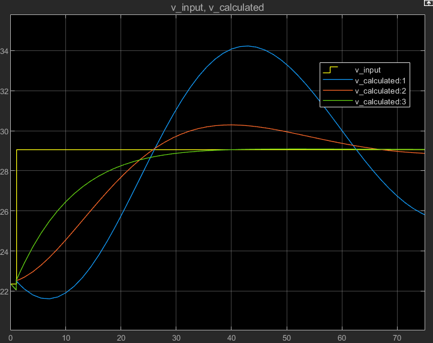

# Cruise-Control-Fisker-Ocean
 
Shown above is a PID Controller automating the cruise control feature on a Fisker Ocean 
The yellow line represents the speed inputted by the driver 
The blue, red, and green lines represent the different proportional gain values of 0, 150, and 350, respectively 
In this case, 50mph is the actual speed and 65mph is the desired speed
